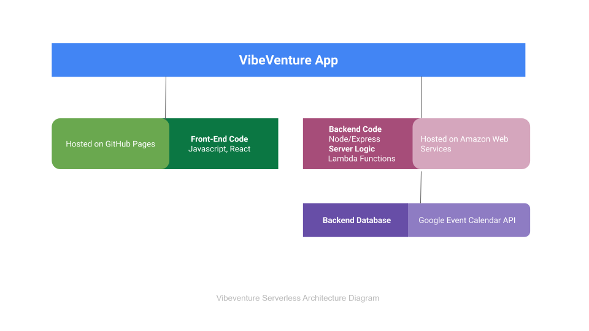

# vibeVenture
event finder
<br/>
<p align="center">
  <a href="https://github.com/ggugliotta/vibeVenture">
    
  </a>

  <h3 align="center">vibeVenture</h3>

  <p align="center">
    A vibe tracker for your local happenings
    <br/>
    <br/>
    <a href="https://github.com/ggugliotta/vibeVenture"><strong>Explore the docs »</strong></a>
    <br/>
    <br/>
    <a href="https://github.com/ggugliotta/vibeVenture">View Demo</a>
    .
    <a href="https://github.com/ggugliotta/vibeVenture/issues">Report Bug</a>
    .
    <a href="https://github.com/ggugliotta/vibeVenture/issues">Request Feature</a>
  </p>
</p>

    

## Table Of Contents

* [About the Project](#about-the-project)
* [Built With](#built-with)
* [Getting Started](#getting-started)
  * [Prerequisites](#prerequisites)
  * [Installation](#installation)
* [Usage](#usage)
* [Roadmap](#roadmap)
* [Contributing](#contributing)
* [Authors](#authors)
* [Acknowledgements](#acknowledgements)

## About The Project


This project was built to locate events happening around the USA. There is a filter option to find vibes near you. This app is a progressive web app with the ability to work offline and a serverless backend developed using a TDD technique. Users of this app will be able to access it whenever they want to view upcoming events for a specific city.



User Stories: 
1. As a user, I would like to be able to filter events by city so that I can see the list of events that take place in that city. 
2. As a user, I would like to be able to show/hide event details so that I can see more/less information about an event. 
3. As a user, I would like to be able to specify the number of events I want to view in the app so that I can see more or fewer events in the events list at once. 
4. As a user, I would like to be able to use the app when offline so that I can see the events I viewed the last time I was online.
5. As a user, I would like to be able to add the app shortcut to my home screen so that I can open the app faster. 
6. As a user, I would like to be able to see a chart showing the upcoming events in each city so that I know what events are organized in which city. 

Scenarios: 

Feature 1: Filter Events By City

Scenario 1: When user hasn't searched for a city, show upcoming events from all cities.
Given user hasn’t searched for any city;
When the user opens the app;
Then the user should see a list of upcoming events.

Scenario 2: User should see a list of suggestions when they search for a city.
* Given that the main page is open;
* When user starts typing in the city textbox;
* Then the user should receive a list of cities (suggestions) that match what they've typed.

Scenario 3: User can select a city from the suggested list.
Given user was typing “Chicago” in the city textbox AND the list of suggested cities is showing;
When the user selects a city (e.g. “Chicago, Illinois”) from the list;
Then their city should be changed to that city(i.e., “Chicago, Il”) AND the user should receive a list of upcoming events in that city.

Feature 2: Show/Hide Event Details

Scenario 1: An event element is collapsed by default
* Given that the user is viewing events for a filtered city;
 When a user scrolls down the results page;
* Then the events element is collapsed by default to show limited information.
  
Scenario 2: User can expand an event to see details.
* Given that the event element is collapsed by default;
* When a user clicks on the element;
* Then the user should be able to open the event element to show more details.
  
Scenario 3:  User can collapse an event to hide details.
* Given that the event element is open;
* When a user clicks on the event element;
* Then the user should be able to collapse the event element to show less details.

Feature 3: Specify Number of Events

Scenario 1: When a user hasn't specified a number, 32 events are shown by default
* Given that the main page is open;
* When a user opens the app;
* Then 32 events will be shown by default.
  
Scenario 2: User can change the number of events displayed. 
* Given that a specific city event results are showing;
* When a user clicks submit on the search bar to filter for a specific city;
* Then an optional setting will show up below to specify the number of events to display.

Feature 4: Use the App When Offline

Scenario 1: Show cached data when there's no internet connection 
* Given that there is no internet connection;
* When a user opens the app;
* Display cached data.

Scenario 2: Show error when user changes search settings (city, number of events)
* Given that there is no internet connection;
* When a user changes search settings in the app (city, number of events);
* Display an error explaining that there is no internet connection. 

Feature 5: Add an App Shortcut to the Home Screen

Scenario 1: User can install vibeVenture as a shortcut on their device home screen. 
* Given that the app is downloaded on the user’s device;
* When the user clicks on the vibeVenture app;
* Then their OS system will allow them to add the app to their home screen.

Feature 6: Display Charts Visualizing Event Details

Scenario 1: Show a chart with the number of upcoming events in each city.
* Given that the main page is open;
* When the user opens the app;
* Then the user should see a chart with a number of upcoming events in each city.


## Built With

* Test driven development (TDD)

* [React ](react.com)
* [CRA](https://create-react-app.dev/)
* [Google Calendar API](https://developers.google.com/calendar/api/quickstart/js)
* [AWS lambda](https://aws.amazon.com/lambda/)
* [Github Pages](https://pages.github.com/)

## Getting Started

To get a local copy up and running follow these simple steps.

### Prerequisites

* npm

```sh
npm install npm@latest -g
```

### Installation

1. Clone the repo 

```sh
git clone https://github.com/ggugliotta_/vibeVenture.git
```

2. Install NPM packages

```sh
npm install
```


## Usage

placeholder for examples of usage 

## Roadmap

See the [open issues](https://github.com/ggugliotta/vibeVenture/issues) for a list of proposed features (and known issues).

## Contributing

Contributions are what make the open source community such an amazing place to be learn, inspire, and create. Any contributions you make are **greatly appreciated**.
* If you have suggestions for adding or removing projects, feel free to [open an issue](https://github.com/ggugliotta/vibeVenture/issues/new) to discuss it, or directly create a pull request after you edit the *README.md* file with necessary changes.
* Please make sure you check your spelling and grammar.
* Create individual PR for each suggestion.
* Please also read through the [Code Of Conduct](https://github.com/ggugliotta/vibeVenture/blob/main/CODE_OF_CONDUCT.md) before posting your first idea as well.

### Creating A Pull Request

1. Fork the Project
2. Create your Feature Branch (`git checkout -b feature/AmazingFeature`)
3. Commit your Changes (`git commit -m 'Add some AmazingFeature'`)
4. Push to the Branch (`git push origin feature/AmazingFeature`)
5. Open a Pull Request

## Authors

* **Shaan Khan** - *Comp Sci Student* - [Shaan Khan](https://github.com/ShaanCoding/) - *Built ReadME Template*
* **Gabriella Gugliotta** - *Full Stack Web Developer* - [Gabriella Gugliotta](https://github.com/ggugliotta) - *Built vibeVenture App *

## Acknowledgements

* [ShaanCoding](https://github.com/ShaanCoding/)
* [Othneil Drew](https://github.com/othneildrew/Best-README-Template)
* [ImgShields](https://shields.io/)
